# 🌟 Aura IDE


> **⚠️ EXPERIMENTAL PROJECT** - This project is currently in early development (MVP stage). Features may be incomplete, flows might not work as expected, and the codebase is actively evolving. This will be polished over time.

**Your AI-powered cloud IDE to accelerate coding and debugging with intelligent assistance.**

Aura IDE is a modern, cloud-based integrated development environment built with SvelteKit 5, featuring AI-powered code assistance, real-time collaboration, and integrated sandbox execution environments.

---

## 📋 Table of Contents

- [Features](#-features)
- [Architecture Overview](#-architecture-overview)
- [Technology Stack](#-technology-stack)
- [Quick Start](#-quick-start)
- [Environment Configuration](#-environment-configuration)
- [Project Structure](#️-project-structure)
- [Available Scripts](#-available-scripts)
- [API Reference](#-api-reference)
- [Contributing](#-contributing)
- [License](#-license)

---

## ✨ Features

### 🤖 AI-Powered Development

- **Intelligent Code Assistance** - Context-aware AI suggestions and code completion
- **Smart Debugging** - AI-driven error detection and resolution recommendations
- **Code Analysis** - Real-time code quality insights and optimization suggestions
- **Multi-Model Support** - OpenAI GPT-4o, Claude, and more via Helicone gateway
- **Agentic Workflow** - Multi-step tool calling with up to 15 sequential actions

### ☁️ Cloud-Native Architecture

- **Sandbox Execution** - Isolated development environments via Daytona
- **Real-time Collaboration** - Live editing and sharing capabilities
- **Live Preview** - Instant application preview with automatic reloading
- **Terminal Access** - Integrated terminal sessions with real-time streaming

### 🛠️ Modern Development Experience

- **CodeMirror 6** - Advanced code editor with syntax highlighting
- **Project Templates** - Quick start with popular frameworks and configurations
- **Chat Interface** - Conversational AI with file context awareness
- **Tool Integration** - Web search, codebase search, file operations, and code execution

---

## 🏗️ Architecture Overview

### High-Level System Architecture

```mermaid
graph TB
    subgraph Client["🖥️ Client Layer"]
        UI[SvelteKit 5 Frontend]
        CM[CodeMirror Editor]
        Chat[AI Chat Interface]
        Term[Terminal Component]
    end

    subgraph API["🔌 API Layer"]
        Routes[SvelteKit API Routes]
        Auth[Better Auth]
        Stream[Agent Stream API]
    end

    subgraph Services["⚙️ Service Layer"]
        ChatSvc[Chat Service]
        SandboxSvc[Sandbox Service]
        DBSvc[Database Service]
        ToolMgr[Tool Manager]
        VectorDB[Vector DB Service]
    end

    subgraph AI["🤖 AI Layer"]
        AITools[AI SDK Tools]
        Models[Model Manager]
        Helicone[Helicone Gateway]
    end

    subgraph External["☁️ External Services"]
        OpenAI[OpenAI API]
        Anthropic[Anthropic API]
        Daytona[Daytona Sandbox]
        Tavily[Tavily Search]
        Qdrant[Qdrant Vector DB]
    end

    subgraph Data["💾 Data Layer"]
        MongoDB[(MongoDB)]
    end

    UI --> Routes
    CM --> Routes
    Chat --> Stream
    Term --> SandboxSvc

    Routes --> Auth
    Routes --> ChatSvc
    Stream --> AITools
    Stream --> Models

    ChatSvc --> DBSvc
    SandboxSvc --> Daytona
    AITools --> ToolMgr
    Models --> Helicone

    Helicone --> OpenAI
    Helicone --> Anthropic
    ToolMgr --> Tavily
    VectorDB --> Qdrant
    DBSvc --> MongoDB
```



### AI Agent Flow


### Sandbox Architecture

```mermaid
graph LR
    subgraph User["👤 User Session"]
        Browser[Browser]
    end

    subgraph App["📱 Aura IDE"]
        Editor[Code Editor]
        FileTree[File Tree]
        Preview[Live Preview]
        Terminal[Terminal]
    end

    subgraph Sandbox["🔒 Daytona Sandbox"]
        FS[File System]
        Runtime[Runtime Environment]
        Server[Dev Server]
    end

    Browser --> Editor
    Browser --> FileTree
    Browser --> Preview
    Browser --> Terminal

    Editor -->|Read/Write| FS
    FileTree -->|List/Navigate| FS
    Terminal -->|Execute| Runtime
    Preview -->|HTTP| Server
    Runtime --> Server
```



### Data Flow Architecture


---

## 🔧 Technology Stack

| Category | Technology |
|----------|------------|
| **Frontend** | SvelteKit 5, TypeScript, Tailwind CSS 4.0 |
| **UI Components** | Shadcn-Svelte, Bits UI, Lucide Icons |
| **Code Editor** | CodeMirror 6 with multiple language support |
| **Backend** | SvelteKit API Routes, Node.js |
| **Database** | MongoDB with native driver |
| **Authentication** | Better Auth with OAuth (Google, GitHub) |
| **AI Integration** | AI SDK v6, OpenAI, Anthropic |
| **AI Gateway** | Helicone (caching, logging, analytics) |
| **Sandbox** | Daytona SDK for isolated environments |
| **Vector Search** | Qdrant for semantic code search |
| **Web Search** | Tavily API integration |
| **Real-time** | Server-Sent Events (SSE) |

---

## 🚀 Quick Start

### Prerequisites

- **Node.js 18+** or **Bun** (recommended)
- **MongoDB** (local or cloud - MongoDB Atlas)
- **Docker** (optional, for development environment)

### Installation

```bash
# Clone the repository
git clone https://github.com/DevRohit06/aura-ide.git
cd aura-ide

# Install dependencies (using bun - recommended)
bun install

# or with pnpm
pnpm install

# Set up environment variables
cp .env.example .env
# Edit .env with your configuration

# Start development server
bun dev
```

The application will be available at `http://localhost:5173`

### Docker Development (Optional)

```bash
# Start supporting services (MongoDB, Qdrant)
docker-compose -f docker-compose.dev.yml up -d

# Start development server
bun dev
```

---

## 🔐 Environment Configuration

Create a `.env` file in the root directory. See `.env.example` for a complete template.

### Required Variables

| Variable | Description |
|----------|-------------|
| `DATABASE_URL` | MongoDB connection string |
| `BETTER_AUTH_SECRET` | Secret key for authentication |
| `HELICONE_API_KEY` | Helicone API key for AI gateway |
| `DAYTONA_API_KEY` | Daytona API key for sandbox |

### Optional Variables

| Variable | Description |
|----------|-------------|
| `GOOGLE_CLIENT_ID/SECRET` | Google OAuth credentials |
| `GITHUB_CLIENT_ID/SECRET` | GitHub OAuth credentials |
| `QDRANT_URL` | Qdrant vector database URL |
| `TAVILY_API_KEY` | Tavily web search API key |

---

## 🗂️ Project Structure

```
aura/
├── src/
│   ├── lib/
│   │   ├── agent/              # AI agent configuration
│   │   │   ├── ai-tools.ts     # AI SDK tool definitions
│   │   │   └── model-manager.ts # Model configuration
│   │   ├── components/         # Svelte components
│   │   │   ├── chat/           # Chat interface components
│   │   │   ├── code-editor/    # CodeMirror editor
│   │   │   ├── editor/         # Editor layout components
│   │   │   └── ui/             # Shadcn-Svelte components
│   │   ├── services/           # Business logic services
│   │   │   ├── chat.service.ts
│   │   │   ├── database.service.ts
│   │   │   ├── sandbox.service.ts
│   │   │   └── sandbox/        # Sandbox providers
│   │   ├── stores/             # Svelte stores
│   │   └── utils/              # Utility functions
│   ├── routes/
│   │   ├── api/                # API endpoints
│   │   │   ├── agent/          # AI agent endpoints
│   │   │   ├── chat/           # Chat management
│   │   │   ├── projects/       # Project CRUD
│   │   │   └── sandbox/        # Sandbox operations
│   │   ├── auth/               # Authentication pages
│   │   ├── editor/             # Editor interface
│   │   └── (dashboard)/        # Dashboard routes
│   └── types/                  # TypeScript definitions
├── scripts/                    # Utility scripts
├── static/                     # Static assets
├── tests/                      # Test files
└── docker-compose.*.yml        # Docker configurations
```

---

## 📝 Available Scripts

```bash
# Development
bun dev                    # Start development server
bun build                  # Build for production
bun preview               # Preview production build

# Code Quality
bun run check             # TypeScript + Svelte check
bun run lint              # Run ESLint + Prettier
bun run format            # Format code with Prettier

# Testing
bun test                  # Run unit tests
bun run test:daytona      # Test Daytona connectivity

# Database
bun run db:init           # Initialize database
bun run db:reset          # Reset database
bun run db:stats          # Database statistics
bun run db:health         # Check database health
```

---

## 📡 API Reference

### Agent Streaming

```
POST /api/agent/stream
```

Streams AI responses with tool calling support.

**Request Body:**
```json
{
  "message": "string",
  "threadId": "string (optional)",
  "projectId": "string",
  "currentFile": "string (optional)",
  "sandboxId": "string (optional)",
  "modelName": "string (optional)"
}
```

### Chat Threads

```
GET  /api/chat/threads           # List threads
POST /api/chat/threads           # Create thread
GET  /api/chat/threads/:id       # Get thread
DELETE /api/chat/threads/:id     # Delete thread
```

### Projects

```
GET  /api/projects               # List projects
POST /api/projects               # Create project
GET  /api/projects/:id           # Get project
PUT  /api/projects/:id           # Update project
DELETE /api/projects/:id         # Delete project
```

### Sandbox Operations

```
POST /api/sandbox/create         # Create sandbox
GET  /api/sandbox/:id/files      # List files
POST /api/sandbox/:id/files      # Write file
POST /api/sandbox/:id/execute    # Execute command
```

---

## ⚠️ Current Limitations (MVP)

> This project is experimental. Please be aware of the following:

- **Incomplete Features**: Some features are still in development
- **UI/UX Polish**: The interface needs refinement
- **Error Handling**: Some edge cases may not be handled gracefully
- **Documentation**: API documentation is still being expanded
- **Testing**: Test coverage is limited
- **Performance**: Optimizations are ongoing

We appreciate your patience as we continue to improve Aura IDE!

---

## 🤝 Contributing

We welcome contributions! Please see our development setup below:

### Development Setup

1. Fork the repository
2. Create a feature branch: `git checkout -b feature/amazing-feature`
3. Make your changes and add tests
4. Ensure all tests pass: `bun test`
5. Format your code: `bun run format`
6. Commit your changes: `git commit -m 'Add amazing feature'`
7. Push to the branch: `git push origin feature/amazing-feature`
8. Open a Pull Request

---

## 📄 License

This project is licensed under the MIT License - see the [LICENSE](LICENSE) file for details.

---

## 🙏 Acknowledgments

- [SvelteKit](https://kit.svelte.dev/) - The web framework
- [Shadcn-Svelte](https://www.shadcn-svelte.com/) - UI component library
- [CodeMirror](https://codemirror.net/) - Code editor
- [Daytona](https://www.daytona.io/) - Development environment platform
- [Vercel AI SDK](https://sdk.vercel.ai/) - AI integration
- [Helicone](https://helicone.ai/) - AI observability

---

<div align="center">
  <p>Built with ❤️ by <a href="https://github.com/DevRohit06">Rohit</a></p>
  <p><strong>🚧 Experimental - Work in Progress 🚧</strong></p>
</div>
