# 🤖 AI Agent Architecture

> **⚠️ EXPERIMENTAL** - The AI agent is under active development. Behavior and capabilities may change.

This document explains how the AI coding assistant works in Aura IDE.

---

## Overview

The Aura IDE AI Agent is an agentic coding assistant that can:
- Understand your codebase context
- Execute multi-step tasks autonomously
- Use tools to read, write, and execute code
- Search the web for documentation
- Perform semantic code search

---

## Architecture

```mermaid
graph TB
    subgraph Input["📥 Input Processing"]
        UserMsg[User Message]
        FileCtx[Current File Context]
        SandboxCtx[Sandbox Context]
        History[Chat History]
    end

    subgraph Agent["🤖 AI Agent"]
        SystemPrompt[System Prompt Builder]
        Model[AI Model]
        ToolRouter[Tool Router]
    end

    subgraph Tools["🔧 Available Tools"]
        WebSearch[Web Search]
        CodeSearch[Codebase Search]
        ReadFile[Read File]
        WriteFile[Write File]
        Execute[Execute Code]
    end

    subgraph Output["📤 Output"]
        Stream[Streaming Response]
        ToolResults[Tool Results]
        Persistence[Database Storage]
    end

    UserMsg --> SystemPrompt
    FileCtx --> SystemPrompt
    SandboxCtx --> SystemPrompt
    History --> SystemPrompt

    SystemPrompt --> Model
    Model --> ToolRouter
    ToolRouter --> Tools
    Tools --> Model

    Model --> Stream
    ToolRouter --> ToolResults
    Stream --> Persistence
```



---

## Agent Flow

### Request Lifecycle


---

## System Prompt

The agent receives a carefully crafted system prompt that includes:

```
You are an expert coding assistant with full access to development tools and sandboxes.

Current Context:
- Current file: [filename or None]
- Sandbox ID: [sandbox-id or None]  
- Sandbox Type: [daytona or local]
- Project ID: [project-id or None]

Project File Structure:
├── 📁 src
│   ├── 📁 components
│   ├── 📁 routes
│   └── 📄 app.ts
├── 📄 package.json
└── 📄 README.md

Available Tools:
- web_search: Search the web for documentation and solutions
- search_codebase: Semantic search through the project codebase
- read_file: Read file contents from the sandbox
- write_file: Write or update files in the sandbox
- execute_code: Execute commands in the sandbox

IMPORTANT INSTRUCTIONS:
1. When using write_file, ALWAYS provide the COMPLETE file content
2. Use the file tree to understand the project structure
3. Be specific about file paths when reading or writing
4. Read existing files before making changes
5. After using tools, provide a clear summary
6. If a tool fails, explain the error and suggest alternatives
```

---

## Available Tools

### 1. Web Search (`web_search`)

Search the internet for documentation, solutions, and information.

```typescript
{
  name: 'web_search',
  description: 'Search the web for documentation, solutions, and information',
  parameters: {
    query: string,      // Search query
    maxResults?: number // Maximum results (default: 5)
  }
}
```

**Use Cases**:
- Finding library documentation
- Searching for error solutions
- Getting up-to-date information

### 2. Codebase Search (`search_codebase`)

Semantic search through the project's codebase using vector embeddings.

```typescript
{
  name: 'search_codebase',
  description: 'Search the codebase semantically for relevant code',
  parameters: {
    query: string,      // Natural language query
    maxResults?: number // Maximum results (default: 10)
  }
}
```

**Use Cases**:
- Finding where a function is defined
- Locating related code patterns
- Understanding code structure

### 3. Read File (`read_file`)

Read the contents of a file from the sandbox.

```typescript
{
  name: 'read_file',
  description: 'Read file contents from the sandbox',
  parameters: {
    filePath: string,   // Path to the file
    sandboxId?: string  // Sandbox ID (uses context if not provided)
  }
}
```

**Use Cases**:
- Understanding existing code before modifications
- Reviewing configuration files
- Checking file contents

### 4. Write File (`write_file`)

Create or update files in the sandbox.

```typescript
{
  name: 'write_file',
  description: 'Write or update file contents in the sandbox',
  parameters: {
    filePath: string, // Path to the file
    content: string,  // Complete file content
    sandboxId: string // Sandbox ID
  }
}
```

**Important**: Always provide the **complete** file content, not just the changes.

**Use Cases**:
- Creating new files
- Updating existing code
- Generating configurations

### 5. Execute Code (`execute_code`)

Run commands in the sandbox terminal.

```typescript
{
  name: 'execute_code',
  description: 'Execute shell commands in the sandbox',
  parameters: {
    command: string,   // Command to execute
    sandboxId: string, // Sandbox ID
    cwd?: string       // Working directory
  }
}
```

**Use Cases**:
- Installing dependencies
- Running tests
- Building projects
- Starting development servers

---

## Multi-Step Execution

The agent can execute up to **15 sequential steps** to complete complex tasks.


### Example Multi-Step Task

**User Request**: "Add a new API endpoint for user profiles"

1. **Step 1**: Search codebase for existing API patterns
2. **Step 2**: Read the existing API file structure
3. **Step 3**: Read a similar endpoint for reference
4. **Step 4**: Write the new endpoint file
5. **Step 5**: Update the route configuration
6. **Step 6**: Execute tests to verify
7. **Step 7**: Provide summary to user

---

## Model Support

### Supported Models

| Model | Provider | Best For |
|-------|----------|----------|
| `gpt-4o` | OpenAI | Complex tasks, code generation |
| `gpt-4-turbo` | OpenAI | Fast, capable responses |
| `claude-3-5-sonnet` | Anthropic | Nuanced understanding |
| `claude-3-opus` | Anthropic | Highest quality output |

### Model Selection

Models are resolved based on naming patterns:

```typescript
function resolveModel(modelName?: string) {
  if (modelName?.includes('claude') || modelName?.includes('anthropic')) {
    return anthropic(modelName);
  }
  if (modelName?.includes('gpt') || modelName?.includes('openai')) {
    return openai(modelName);
  }
  return openai('gpt-4o'); // Default
}
```

---

## Streaming Response

The agent uses AI SDK v6's UI Message streaming format:

```typescript
// Response format
{
  type: 'text' | 'tool-call' | 'tool-result',
  content: string | ToolCall | ToolResult
}
```

### Client-Side Handling

```typescript
// Consuming the stream
const response = await fetch('/api/agent/stream', {
  method: 'POST',
  body: JSON.stringify({ message, projectId, threadId })
});

const reader = response.body.getReader();
while (true) {
  const { done, value } = await reader.read();
  if (done) break;
  // Process streamed chunks
}
```

---

## Error Handling

### Tool Errors

When tools fail, the agent:
1. Reports the error clearly
2. Suggests alternative approaches
3. Continues if possible

### Rate Limiting

- Helicone gateway handles rate limiting
- Automatic retry with exponential backoff
- User notification on persistent failures

---

## Best Practices

### For Users

1. **Be specific**: Provide clear, detailed requests
2. **Provide context**: Mention relevant files or features
3. **Review changes**: Always review AI-generated code
4. **Iterate**: Use follow-up messages to refine

### For Developers

1. **Tool design**: Keep tools focused and single-purpose
2. **Error messages**: Provide actionable error information
3. **Logging**: Log tool calls for debugging
4. **Testing**: Test tool behavior with various inputs

---

## Limitations

> Current MVP limitations to be aware of:

- Maximum 15 steps per request
- No persistent memory across sessions
- Limited to Daytona sandbox provider
- No support for binary files
- Tool execution is sequential (no parallel calls)

---

## Future Improvements

- [ ] Persistent agent memory
- [ ] Parallel tool execution
- [ ] Custom tool definitions
- [ ] Human-in-the-loop confirmations
- [ ] Enhanced context window management

---

<div align="center">
  <p><strong>🚧 Agent capabilities are expanding 🚧</strong></p>
</div>
