# 🏗️ System Architecture

> **⚠️ EXPERIMENTAL** - This architecture is evolving. Some components may change as the project matures.

This document provides a comprehensive overview of the Aura IDE system architecture.

---

## Overview

Aura IDE is built as a modern, cloud-native application with a focus on:
- **Modularity**: Loosely coupled services that can evolve independently
- **Scalability**: Designed for horizontal scaling
- **Developer Experience**: Fast iteration and debugging
- **AI-First**: Deep integration with AI capabilities

---

## High-Level Architecture


---

## Component Details

### 1. Frontend Layer

#### SvelteKit 5 Application
- **Framework**: SvelteKit 5 with TypeScript
- **Styling**: Tailwind CSS 4.0
- **UI Components**: Shadcn-Svelte (Bits UI based)
- **State Management**: Svelte stores

#### Code Editor
- **Engine**: CodeMirror 6
- **Features**:
  - Syntax highlighting for 10+ languages
  - Auto-completion
  - Multi-cursor support
  - Theme support (One Dark, etc.)

#### Chat Interface
- **Real-time streaming**: SSE-based responses
- **File context**: Attach current file to messages
- **Tool call display**: Visual representation of AI actions
- **Markdown rendering**: Rich text with code blocks

### 2. API Layer

#### SvelteKit API Routes
```
/api
├── /agent
│   └── /stream          # AI agent streaming
├── /auth
│   └── /[...all]        # Authentication routes
├── /chat
│   ├── /threads         # Thread management
│   └── /messages        # Message operations
├── /projects
│   ├── /[id]            # Project CRUD
│   └── /templates       # Project templates
├── /sandbox
│   ├── /create          # Create sandbox
│   ├── /[id]/files      # File operations
│   └── /[id]/execute    # Command execution
└── /vector-db
    ├── /search          # Semantic search
    └── /index           # Indexing operations
```

#### Authentication
- **Provider**: Better Auth
- **Methods**: Email/Password, Google OAuth, GitHub OAuth
- **Session**: MongoDB-backed sessions
- **Security**: CSRF protection, secure cookies

### 3. Service Layer


#### Key Services

| Service | Purpose |
|---------|---------|
| `DatabaseService` | MongoDB operations, CRUD for all entities |
| `ChatService` | Chat thread and message management |
| `SandboxService` | Sandbox lifecycle and file operations |
| `ToolManager` | AI tool registration and execution |
| `VectorDBService` | Semantic search with Qdrant |

### 4. AI Layer

#### AI SDK Integration
- **Version**: AI SDK v6
- **Features**:
  - Multi-step tool calling
  - UI Message streaming
  - Model abstraction

#### Supported Models
| Provider | Models |
|----------|--------|
| OpenAI | GPT-4o, GPT-4 Turbo, GPT-3.5 |
| Anthropic | Claude 3.5 Sonnet, Claude 3 Opus |

#### AI Tools

```mermaid
graph LR
    Agent[AI Agent]
    
    Agent --> WebSearch[🔍 Web Search]
    Agent --> CodeSearch[📂 Codebase Search]
    Agent --> ReadFile[📄 Read File]
    Agent --> WriteFile[✏️ Write File]
    Agent --> Execute[⚡ Execute Code]

    WebSearch --> Tavily[(Tavily API)]
    CodeSearch --> Qdrant[(Qdrant)]
    ReadFile --> Daytona[Daytona Sandbox]
    WriteFile --> Daytona
    Execute --> Daytona
```



### 5. Data Layer

#### MongoDB Collections

| Collection | Purpose |
|------------|---------|
| `users` | User accounts and profiles |
| `projects` | Project metadata and settings |
| `sessions` | User sessions |
| `chatThreads` | Chat conversation threads |
| `chatMessages` | Individual chat messages |
| `sandboxSessions` | Active sandbox sessions |

#### Indexes
- User email (unique)
- Project by user ID
- Chat messages by thread ID
- Sandbox sessions by status

---

## Data Flow

### Message Flow


### File Operations Flow


---

## Security Considerations

### Authentication
- OAuth 2.0 with PKCE
- Secure session management
- CSRF protection

### Sandbox Isolation
- Each user gets isolated sandbox
- Network isolation
- Resource limits

### Data Protection
- Environment variables for secrets
- MongoDB authentication
- HTTPS in production

---

## Deployment Architecture


---

## Future Considerations

> These are planned improvements for post-MVP

- [ ] WebSocket for real-time collaboration
- [ ] Redis for caching and pub/sub
- [ ] Kubernetes deployment
- [ ] Multi-region support
- [ ] Enhanced security auditing

---

<div align="center">
  <p><strong>🚧 Architecture is evolving 🚧</strong></p>
</div>
