# 🏖️ Sandbox Integration

> **⚠️ EXPERIMENTAL** - Sandbox features are under active development.

This document explains the sandbox architecture and integration in Aura IDE.

---

## Overview

Sandboxes provide isolated development environments where code can be:
- Written and modified
- Executed safely
- Previewed in real-time
- Tested independently

---

## Architecture

```mermaid
graph TB
    subgraph User["👤 User"]
        Browser[Browser]
    end

    subgraph Aura["🖥️ Aura IDE"]
        Editor[Code Editor]
        Terminal[Terminal]
        Preview[Preview Panel]
        FileTree[File Tree]
    end

    subgraph DaytonaCloud["☁️ Daytona Cloud"]
        API[Daytona API]
        Sandbox[Sandbox Instance]
        FS[File System]
        Runtime[Runtime]
        DevServer[Dev Server]
    end

    Browser --> Editor
    Browser --> Terminal
    Browser --> Preview
    Browser --> FileTree

    Editor -- Write File --> API
    Terminal -- Execute --> API
    Preview -- HTTP --> DevServer
    FileTree -- List --> API

    API --> Sandbox
    Sandbox --> FS
    Sandbox --> Runtime
    Runtime --> DevServer
```



---

## Providers

### Daytona (Primary)

[Daytona](https://www.daytona.io/) is the primary sandbox provider.

**Features**:
- Pre-configured development environments
- Multiple language support
- Persistent storage
- Network isolation
- Live preview URLs

**Configuration**:
```env
DAYTONA_API_KEY=your_api_key
DAYTONA_API_URL=https://api.daytona.io
DAYTONA_TARGET=us
DAYTONA_ENABLED=true
```

---

## Sandbox Lifecycle


### States

| State | Description |
|-------|-------------|
| `creating` | Sandbox is being provisioned |
| `running` | Sandbox is active and ready |
| `stopping` | Sandbox is shutting down |
| `stopped` | Sandbox is inactive |
| `failed` | Sandbox creation failed |

---

## File Operations

### Service Layer


### Available Operations

| Operation | Method | Description |
|-----------|--------|-------------|
| List Files | `listFiles(sandboxId, path)` | Get directory contents |
| Read File | `readFile(sandboxId, path)` | Get file contents |
| Write File | `writeFile(sandboxId, path, content)` | Create/update file |
| Delete File | `deleteFile(sandboxId, path)` | Remove file |
| Create Dir | `createDirectory(sandboxId, path)` | Create directory |

### Example Usage

```typescript
import { SandboxService } from '$lib/services/sandbox.service';

const sandbox = SandboxService.getInstance();

// List files
const files = await sandbox.listFiles('sandbox123', '/src');

// Read file
const content = await sandbox.readFile('sandbox123', '/src/app.ts');

// Write file
await sandbox.writeFile('sandbox123', '/src/new.ts', 'console.log("hi");');
```

---

## Command Execution

### Process Flow


### Supported Commands

- Package management: `npm`, `yarn`, `pnpm`, `bun`
- Build tools: `vite`, `webpack`, `esbuild`
- Runtime: `node`, `python`, `go`, `rust`
- Version control: `git`
- General utilities: `ls`, `cat`, `mkdir`, etc.

### Example

```typescript
const result = await sandbox.executeCommand(
  'sandbox123',
  'npm install lodash',
  { cwd: '/home/daytona' }
);

console.log(result.stdout);  // "added 1 package..."
console.log(result.exitCode); // 0
```

---

## Preview System

### Architecture


### How It Works

1. User starts a dev server in the sandbox (e.g., `npm run dev`)
2. Dev server binds to a port (e.g., 3000)
3. Daytona exposes the port via a unique URL
4. Aura IDE shows the preview in an iframe

### Preview URLs

Each sandbox gets a unique preview URL:
```
https://{sandbox-id}.daytona.io/
```

Port-specific URLs:
```
https://{sandbox-id}-{port}.daytona.io/
```

---

## Terminal Integration

### WebSocket Connection


### Features

- Full PTY support
- ANSI color rendering
- Window resize handling
- Multiple terminal sessions

---

## Project Templates

### Available Templates

| Template | Stack | Description |
|----------|-------|-------------|
| `react-ts` | React + TypeScript + Vite | Modern React setup |
| `vue-ts` | Vue 3 + TypeScript + Vite | Vue.js project |
| `svelte-ts` | SvelteKit + TypeScript | Full-stack Svelte |
| `node-ts` | Node.js + TypeScript | Backend API |
| `python` | Python 3 + FastAPI | Python web service |

### Custom Templates (Future)

> Planned for future releases

```yaml
# template.yaml
name: my-template
description: My custom template
stack:
  - node:18
  - postgres:15
files:
  - package.json
  - src/index.ts
scripts:
  postCreate: npm install
```

---

## Resource Management

### Limits

Each sandbox has resource limits:

| Resource | Default | Max |
|----------|---------|-----|
| CPU | 2 cores | 4 cores |
| Memory | 2 GB | 8 GB |
| Storage | 10 GB | 50 GB |
| Timeout | 1 hour | 24 hours |

### Cleanup

Inactive sandboxes are cleaned up after:
- **Development**: 1 hour of inactivity
- **Preview**: 15 minutes of inactivity

---

## Error Handling

### Common Errors

| Error | Cause | Solution |
|-------|-------|----------|
| `SANDBOX_NOT_FOUND` | Invalid sandbox ID | Create new sandbox |
| `SANDBOX_STOPPED` | Sandbox is inactive | Restart sandbox |
| `FILE_NOT_FOUND` | Path doesn't exist | Check path |
| `PERMISSION_DENIED` | No write access | Check permissions |
| `QUOTA_EXCEEDED` | Resource limit | Upgrade or cleanup |

### Example Error Handling

```typescript
try {
  await sandbox.writeFile(sandboxId, path, content);
} catch (error) {
  if (error.code === 'SANDBOX_STOPPED') {
    await sandbox.startSandbox(sandboxId);
    await sandbox.writeFile(sandboxId, path, content);
  } else {
    throw error;
  }
}
```

---

## Integration with AI Agent

The AI agent can interact with sandboxes through tools:


### Tool Flow

1. User asks AI to modify code
2. Agent calls `read_file` to understand current state
3. Agent calls `write_file` with updated content
4. Agent optionally calls `execute_code` to test

---

## Security

### Isolation

- Each sandbox runs in its own container
- Network isolation between sandboxes
- No access to host system

### Permissions

- Users can only access their own sandboxes
- Project collaborators share sandbox access
- Admin can access all sandboxes

### Data Protection

- Files encrypted at rest
- TLS for all communications
- Regular security audits

---

## Limitations (MVP)

- Single provider (Daytona only)
- Limited resource customization
- No persistent volumes between sessions
- WebSocket limitations in some scenarios

---

<div align="center">
  <p><strong>🚧 Sandbox features are expanding 🚧</strong></p>
</div>
